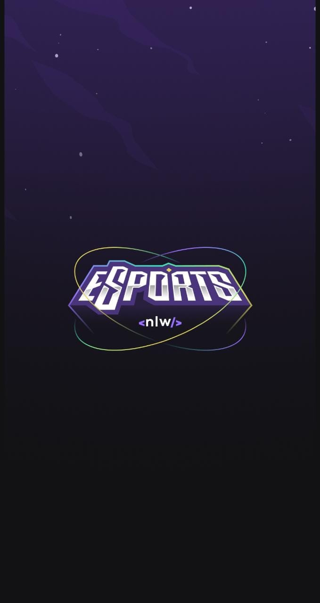
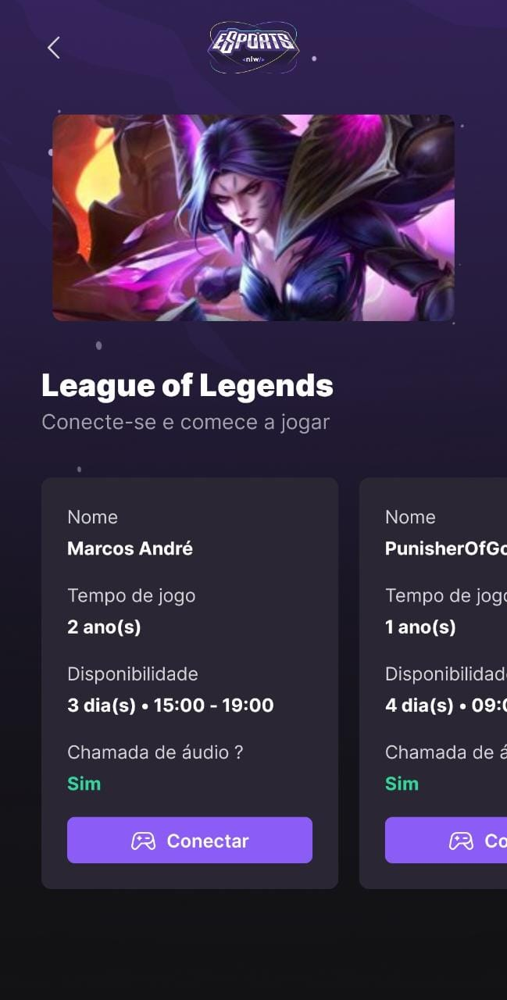

<div align="center">
	
  
  
  
</div>

## :dart: Objetivo

Projeto mobile de estudos desenvolvido durante aulas do Nlw.

## :hammer_and_wrench: Ferramentas

- [axios](https://axios-http.com/ptbr/docs/intro)
- [expo](https://expo.dev/)
- [phosphoricons](https://phosphoricons.com/)
- [react-native](https://reactnative.dev/)
- [typescript](https://www.typescriptlang.org/)

## :desktop_computer: Padronização de código

- [Eslint](https://eslint.org/)
- [Prettier](https://prettier.io/)
- [EditorConfig](https://editorconfig.org/)

## :rocket: Executando o projeto

```bash
// Instale as dependências

yarn install

// Concluindo a instalação rode

yarn start
```
